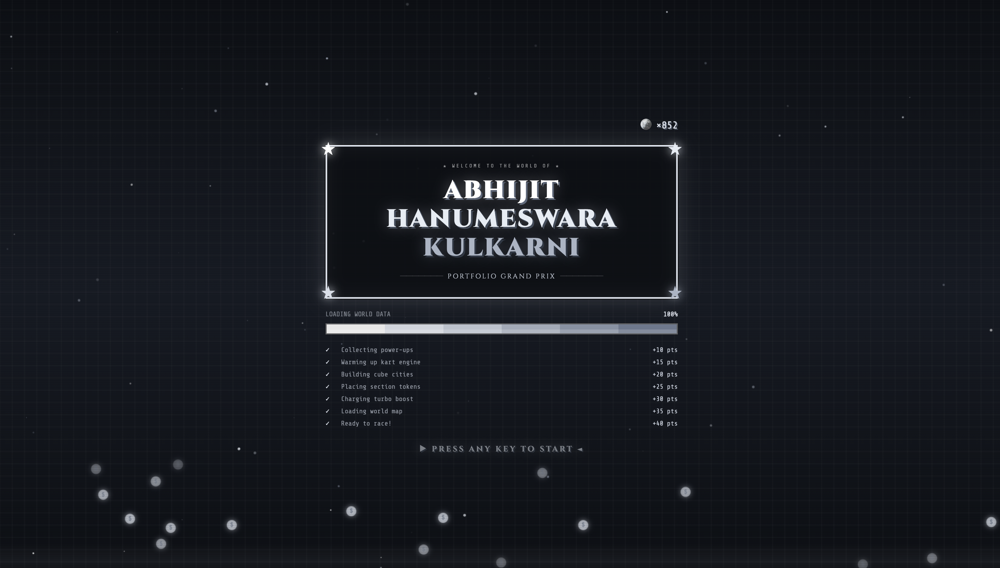

# Portfolio Grand Prix

An interactive personal portfolio built as a playable **isometric driving game**, powered by a hand-written **HTML5 Canvas** engine — no game framework, just raw canvas rendering, drift physics, and a lot of trial and error.

## Features

- Drift physics for the driving mechanics
- Destructible voxel buildings you can crash through
- Month-based seasonal themes that change the world's look
- Built with **React** and **TypeScript**
- Deployed on **GitHub Pages**

## Live Demo

[Try it here](https://abhijithanumeswarakulkarni.github.io/)
